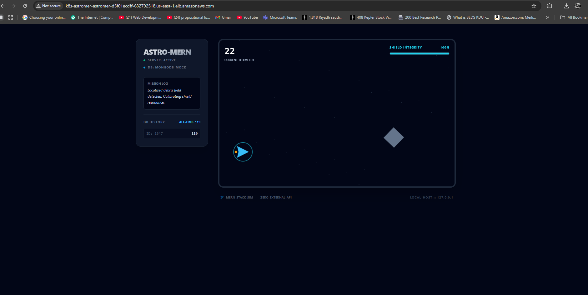
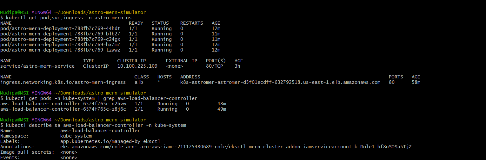

# 🚀 Frontend Application Deployment on Amazon EKS

This project demonstrates how to deploy a **production-ready frontend application** on **Amazon EKS (Elastic Kubernetes Service)** using **AWS Fargate** and an **Application Load Balancer (ALB)**.

The focus of this project is **containerization, Kubernetes orchestration, IAM security, and AWS networking** — not backend development.

---

## 📊 Project Evidence

Since AWS resources incur cost, the cluster was deleted after verification.  
The following screenshots prove successful deployment and operation.

### 1️⃣ Live Application via AWS Load Balancer

This screenshot shows the frontend application running successfully on a **public AWS Application Load Balancer URL**, served through **NGINX** inside a Kubernetes pod.



---

### 2️⃣ Kubernetes Infrastructure on EKS

This terminal output confirms:

- Pods running on **AWS Fargate**
- Kubernetes **Service** and **Ingress** configuration
- **ALB DNS** created dynamically by the AWS Load Balancer Controller



---

## 🛠️ Tech Stack

- **Cloud**: Amazon Web Services (AWS)
- **Container Orchestration**: Amazon EKS (Kubernetes)
- **Compute**: AWS Fargate (Serverless)
- **Networking**: AWS Application Load Balancer (ALB)
- **Ingress Controller**: AWS Load Balancer Controller
- **Containers**: Docker (Multi-stage build)
- **Web Server**: NGINX
- **Frontend**: React / Astro

---

## 💡 Key Problems I Solved

### 🔐 IAM Security (IRSA)
Configured **IAM Roles for Service Accounts (IRSA)** to allow Kubernetes to create and manage ALBs **without using static AWS credentials**.

### 🚀 Production-Grade Frontend Build
Migrated from a development server to a **multi-stage Docker build with NGINX** for performance, security, and AWS compatibility.

### 🧩 ALB Controller Debugging
Resolved **AccessDenied** errors by updating IAM policy versions to allow proper **listener and load balancer attribute management**.

---

## 🏗️ Implementation Flow

1. Created an EKS cluster with **Fargate profiles** using `eksctl`
2. Built and pushed a **Dockerized frontend image**
3. Installed **AWS Load Balancer Controller** via Helm
4. Deployed Kubernetes **Deployment**, **Service**, and **Ingress** manifests
5. Verified public access through **ALB DNS**

---


## 🧹 Cost Management

The cluster was deleted immediately after validation to avoid AWS charges:

```bash
eksctl delete cluster --name mern-cluster

